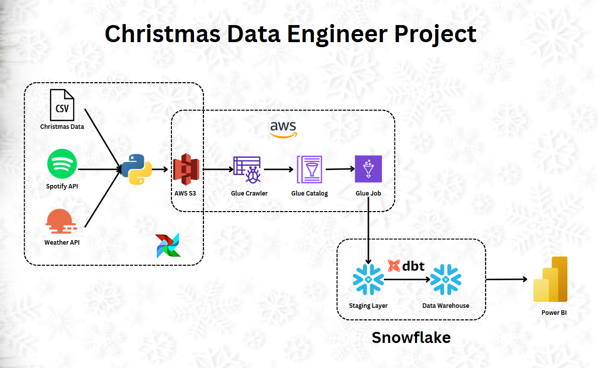
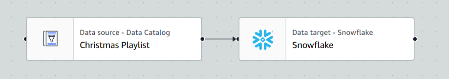

# Christmas Project

## Overview



## Project Setup


### Snowflake Setup

- Create Snowflake account (you can try with the free tier) and make sure to choos AWS as your cloud integration
- Create new data and name it as `CHRISTMAS_DATA`
- Run this to integrate your airflow with 
- get private link to get hostname and port for snowflake ([reference](https://docs.snowflake.com/en/user-guide/admin-security-privatelink)) to connect your snowflake with your AWS Glue ETL later

```
SELECT SYSTEM$ALLOWLIST();
```

- create tables for `christmas_playlist`, `christmas_movies`, `christmas_sales`, `christmas_weather` in `CHRISTMAS_DATA` database

### AWS Setup

- Create IAM ROLE in AWS for AWS for secret manager, s3 and AWS Glue
- Creat AWS Secret Manager for snowflake. Choose **Other type of secret** and fill this key and value for snowflake connection
```
KEY= sfUser, Value= your snowflake login username
KEY= sfPassword, value= your snowflake login password
```
- Create S3 bucket name it as `christmas-project-data`
- Create `AWS Glue Crawler` and `AWS Glue Data Catalog`
- Create ETL JOB in AWS Glue and connect data from source AWS Data Catalog (Source) to Snoflake (Target)

### Docker Setup

- in Docker compose, fill this environment variables with your key

```
SPOTIFY_CLIENT_ID: <SPOTIFY CLIENT ID>
SPOTIFY_CLIENT_SECRET: <SPOTIFY CLIENT SECRET>
WEATHER_API_KEY: <WEATHER API KEY>
AWS_REGION_NAME: <AWS REGION NAME>
AWS_SECRET_ACCESS_KEY: <AWS SECRET ACCESS KEY>
AWS_ACCESS_KEY_ID: <AWS ACCESS KEY ID>
```

## Run Project

1. run ```docker-compose up --build -d```
2. then run the DAG for **christmas_data_pipeline**
3. Create and run AWS Glue Crawler and make sure to schedule the crawler daily after the DAG running to keep the data updated
4. Create and run AWS Glue ETL Job and make sure to schedulte the ETL daily after the DAG and Crawler running 



## Data

- Christmas Shop: Walmart Data Scraping
- Weather API: https://openweathermap.org/price#weather
- Christmas Sales Data and Trend: https://www.kaggle.com/datasets/ibikunlegabriel/christmas-sales-and-trends
- Christmas Movies: https://www.kaggle.com/datasets/jonbown/christmas-movies
- Playlist data: https://developer.spotify.com/documentation/web-api/reference/search 